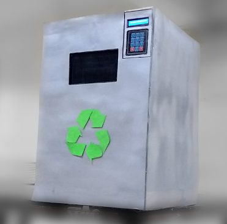
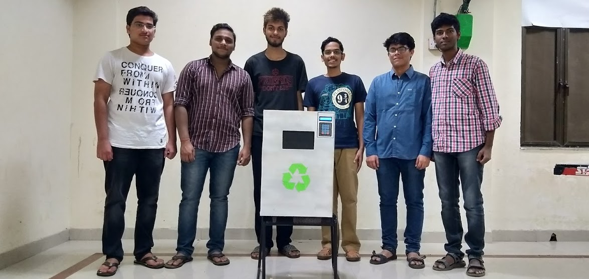

# Product Name
> IoT Smart Bin for gamifying Recyclable waste collection

People in India are often hesitant to separate Recyclable waste and give it away to recycling plants. Even 
if they do, they might have to go through middlemen who may try to deceive them in terms of weight 
and price. This bin aims at eliminating all of the hassle by allowing (authenticated) users to put 
recyclable waste in the bin and providing them with incentives in the form of store credits, e-wallet 
balance etc.

The script is designed to run on a Raspberry Pi Zero with all dependenices installed. See [Website](https://sites.google.com/view/ds302/team-a) for full feature list, hardware requirements, circuit diagram and setup.



## Dependencies

Twilio API usage requires Account SID and Auth token, available after making an account with them.

### On Raspberry Pi:
* RPi GPIO 		- communication with sensors
* RPLCD			- display control over i2c
* serial		- communication with Arduino through otg
* pad4pi		- keypad support
* gpiozero 		- DistanceSensor for ultrasonic distance sensor
* SQLAlchemy	- database connection
* Twilio client	- REST API for sending SMS

You can install all dependencies by

```sh
pip install twilio pad4pi rplcd sqlalchemy
```

### On Arduino:
* HX711			- Library for HX711 weight sensor

## Steps

1. Setup all hardware based on circuit diagram and install dependencies on both RPi and Arduino.

2. Generate the database on RPi by

```sh
$ python scripts/generate_db.py
```

3. Replace <ADD_SID_HERE> and <ADD_AUTH_TOKEN_HERE> in scripts/rpi.py with Account SID and Auth token from Twilio website (to use their API)

4. Power up the Arduino and upload scripts/arduino.ino. The Arduino should start giving out values on serial monitor.

5. Connect Arduino to RPi using USB OTG cable.

6. Run script on RPi using

```sh
$ python scripts/rpi.py
```

## Team members

* Ayaskant Panigrahi
* Sai Anurag Varanasi
* Ambati Naveen
* Mohammed Sohail
* Yash Raj Kapoor
* Rhythum Goel


